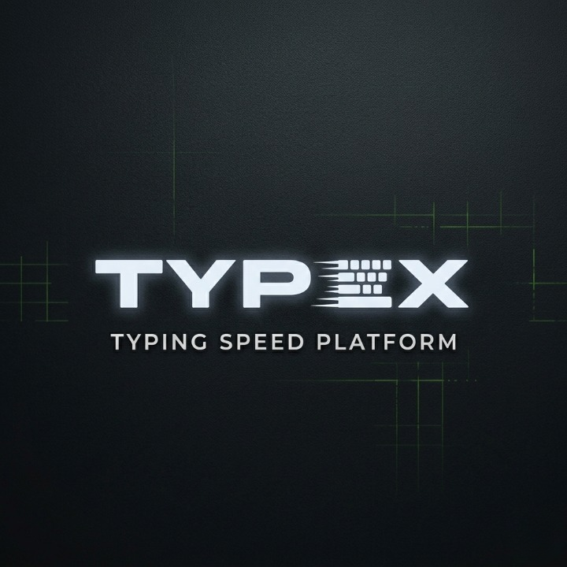

# ◈ TYPEX v2 ◈
**Neo-Noir Terminal Speed Typing Interface**

## overview
TYPEX v2 is a high-performance, minimalist typing application built for developers and terminal enthusiasts. It combines a retro-futuristic aesthetic with modern web performance, featuring a custom particle system, real-time analytics, and a "system boot" experience.

## ✨ Key Features
* **Neo-Noir Aesthetic:** A dark-mode optimized interface with scanlines, vignettes, and a dynamic grid background.
* **Real-time Analytics:** Track WPM (Words Per Minute), Accuracy, and Raw Speed as you type.
* **Multiple Modes:** Support for Easy, Medium, and Hard word pools, plus a custom text mode.
* **Particle Burst System:** Satisfying visual feedback for every correct keystroke.
* **Responsive Design:** Fully optimized for different screen sizes, maintaining a consistent "command-line" feel.
* **Performance Tracking:** Local storage integration to save your session history and personal bests.

## 🛠️ Tech Stack
* **HTML5 / CSS3:** Custom CSS variables for easy theming and complex keyframe animations.
* **Vanilla JavaScript (ES6+):** Pure logic for the typing engine, timer system, and DOM manipulation.
* **Canvas API:** Used for the background particle effects and ambient movement.
* **Google Fonts:** Utilizing *Syne* for branding and *JetBrains Mono* for that developer-centric feel.
